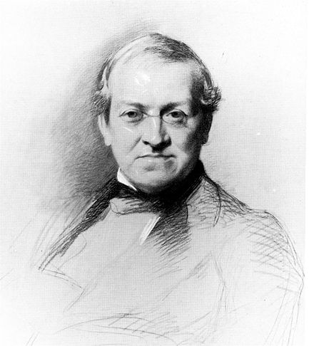

 
 
 <h1>Play cipher encryption</h1>
        <h4>One of the most popular encryption models in the world, was the first cipher to encrypt pairs of letters in cryptologic history.   
              <q>Wheatstone</q> invented the cipher for secrecy in telegraphy, but it carries the name of his friend <q>Lord Playfair</q>. </h4>
         
      

            
     &nbsp;&nbsp;&nbsp;&nbsp;&nbsp;&nbsp;&nbsp;&nbsp;&nbsp;&nbsp;&nbsp;&nbsp;Wheatstone  &nbsp;&nbsp;&nbsp;&nbsp;&nbsp;&nbsp;&nbsp;&nbsp;&nbsp;&nbsp;&nbsp;&nbsp;&nbsp;&nbsp;&nbsp;&nbsp;&nbsp;&nbsp;&nbsp;&nbsp;&nbsp;&nbsp;&nbsp;&nbsp;&nbsp;&nbsp;&nbsp;&nbsp;  Lord Playfair  

        

         
    

        <h2>What is the encryption method?</h2>
        <h4>The playfair cipher requires 5*5 matrix consists with english alphabetic which equle 25 letters, but we missing out one char!!, the char that we throw out is "J", we don't need it in this encryption.</h4>
       <h2>For example:</h2>
       <h3>Let's assume that the wordkey is "mouseye" the matrix will be like this:</h3>
       
       <h3>The first thing we notice that is the letters of the key word are written at beginning, and "e" char has not been rewritten.  
       that because we need from the key word only "chars" not whole "keyword".</h3>
       <h3> Assume that the plaintxet is "cold", here is how to encrypted</h3>
       <h2>stpe 1 'c' and 'o':</h2>
       
       <h3>When we find the tow letters, we put square around them, and after this we chose the most left letter (for c) and the most right letter (for o) to be "AS" </h3>
       <h2>Step 2 'l' and 'd' :</h2>
       
       <h3>Doing the same thing to get the cipher text: "ASRY" </h3>
          
       <h1>Code interpretation </h1>
       
        String preparedText = preparePlaintext(plaintext);
        String encryptedText = encrypt(preparedText, matrix);

        System.out.println("\nEncrypted Text: " + encryptedText);
    }
<h3>Using preparePlaintext and encrypt methods  </h3>

   

   

       public class playfair_Cipher {
    public static void main(String[] args) {
        Scanner scanner = new Scanner(System.in);
        System.out.println("W       W      EEEEE      L           CCCCC      OOOOO      M     M      EEEEE");
        System.out.println("W       W      E          L          C          O     O     MM   MM      E    ");
        System.out.println("W   W   W      EEEE       L          C          O     O     M M M M      EEEE ");
        System.out.println(" W W W W       E          L          C          O     O     M  M  M      E    ");
        System.out.println("  W   W        EEEEE      LLLLL      CCCCC       OOOOO      M     M      EEEEE");
        System.out.println();
        System.out.println("**************************************************************************************************************");
        System.out.println("|______________________________________________________________________________________________________________|");
       
        System.out.println("Playfair Cipher Encryption");

<h5>Welcome design</h5>

` System.out.print("Enter Keyword: ");
        String keyword = scanner.nextLine().toUpperCase().replaceAll("[^A-Z]", "").replace('J', 'I');
       char[][] matrix = createMatrix(keyword); 
       printmatrix(matrix);
         System.out.print("Enter Text to Encrypt: ");
        String plaintext = scanner.nextLine().toUpperCase().replaceAll("[^A-Z]", "").replace('J', 'I');
        if (keyword.isEmpty() || plaintext.isEmpty()) {
            System.out.println("Please provide both a keyword and plaintext.");
            return;
        }`

<h5>The program ask user to write the keyword, the </h5>  

`scanner.nextLine()`
To make the user able to put input. 
 

`.toUpperCase()`
 To make all alphabets capitales 

`replaceAll("[^A-Z]", "").replace('J', 'I');` 
 To replace all input dose't letters to nothing, and replace any input hava 'j' char to 'i' because we don't want 'j' letter. 

` if (keyword.isEmpty() || plaintext.isEmpty()) {
            System.out.println("Please provide both a keyword and plaintext.");
            return;
        }`

If the keyword or the plaintext are empty print "Please provide both a keyword and plaintext." 

`
public static char[][] createMatrix(String keyword) {
        String alphabet = "ABCDEFGHIKLMNOPQRSTUVWXYZ"; 
        char[][] matrix = new char[5][5];
        boolean[] used = new boolean[26];
        int index = 0;
        for (char c : keyword.toCharArray()) { 
            if (!used[c - 'A']) {
                matrix[index / 5][index % 5] = c;
                used[c - 'A'] = true;
                index++;
            }
        }
        for (char c : alphabet.toCharArray()) {
            if (!used[c - 'A']) {
                matrix[index / 5][index % 5] = c;
                used[c - 'A'] = true;
                index++;
            }
        }
        return matrix;
    }`
        
  `  String alphabet = "ABCDEFGHIKLMNOPQRSTUVWXYZ"; 
        char[][] matrix = new char[5][5];
        boolean[] used = new boolean[26];
         int index = 0;
`
   <h4> create the alphabets with out j, create char vairable with 2D array, boolean to check if char has been used or not, and index vairable to track the String alphabet.  </h4>
   
` for (char c : keyword.toCharArray()) { 
            if (!used[c - 'A']) {
                matrix[index / 5][index % 5] = c;
                used[c - 'A'] = true;
                index++;
            }
        }`
        <h4> keyword.toCharArray(); converts the keyword string into an array of characters.  for (char c : keyword.toCharArray()) iterates though each in the alphabets      if (!used[c - 'A']) neans if the if the char does't already used and It has't been placed, doing what inside the term    
 matrix[index / 5][index % 5] = c;
                used[c - 'A'] = true;
                index++; this opration help us to find the specific index that we want to catch, the next line put the boolean "used" in the same index to be true and prevnte use the same char more time.</h4>

        `  for (char c : alphabet.toCharArray()) {
            if (!used[c - 'A']) {
                matrix[index / 5][index % 5] = c;
                used[c - 'A'] = true;
                index++;
            }
        }
        return matrix;
    }``
 
<h4> alphabet.toCharArray(); converts the alphabet string into an array of characters.  for (char c : alphabet.toCharArray()) iterates though each in the alphabets      if (!used[c - 'A']) neans if the if the char does't already used and It has't been placed, doing what inside the term    
 matrix[index / 5][index % 5] = c;
                used[c - 'A'] = true;
                index++;     This method create a 5*5 matrix with the keword. </h4>

                public static void printmatrix(char  matrix [][] ){
        System.out.println("\n");
        System.out.println("****************************************");
        System.out.println("\n");

        System.out.println("5x5 PLAYFAIR CIPHER MATRIX!!!!!!:");
    for (int i = 0; i<5; i++){
    System.out.println(" ");
    if(i==0){
        System.out.println("___________________");
     
    } 
    for(int j=0; j<5; j++)
    {
    System.out.print(matrix[i][j]+ " | "); 
    }
    if(i==4 && i==4){
    System.out.println();
    System.out.println("___________________");
    }
    } 
    }

method to design the output like the pictuer above 

  

    public static String preparePlaintext(String plaintext) {
        StringBuilder prepared = new StringBuilder();
        
        for (int i = 0; i < plaintext.length(); i++) {

            char current = plaintext.charAt(i);

            prepared.append(current);

            if (i + 1 < plaintext.length() && current == plaintext.charAt(i + 1)) {
                prepared.append('X');
            }
        }

       
        if (prepared.length() % 2 != 0) {

            prepared.append('X');
        }

        return prepared.toString();
    }

<h4>This method helpe us to prepare the plaintext, from add "X" char if the number of letters of plaintext dose't even number </h4>

` for (int i = 0; i < plaintext.length(); i++) {
            char current = plaintext.charAt(i);
            prepared.append(current);
            if (i + 1 < plaintext.length() && current == plaintext.charAt(i + 1)) {
                prepared.append('X');
            }
        }`
          
   the for loop that provide `for (int i = 0; i < plaintext.length(); i++)  { 
   char current = plaintext.charAt(i);` used to confirm at what number the plain text stop.   ` prepared.append(current);` used to hold all plain text   `            if (i + 1 < plaintext.length() && current == plaintext.charAt(i + 1)) {
                prepared.append('X');
            }
        }`
     If there's a next character `(i + 1 < plaintext.length())`.
    If the current character is the same as the next character `(current == plaintext.charAt(i + 1))`.

If both are true:
   An 'X' is added to separate the duplicate characters.
        
        

 

        

