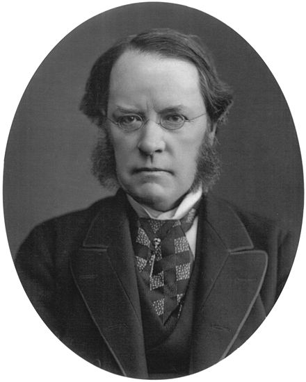

 <h1>Play cipher encryption</h1>
        <h4>One of the most popular encryption models in the world, was the first cipher to encrypt pairs of letters in cryptologic history.   
              <q>Wheatstone</q> invented the cipher for secrecy in telegraphy, but it carries the name of his friend <q>Lord Playfair</q>. </h4>
            
             
            
     &nbsp;&nbsp;&nbsp;&nbsp;&nbsp;&nbsp;&nbsp;&nbsp;&nbsp;&nbsp;&nbsp;&nbsp; Lord Playfair  &nbsp;&nbsp;&nbsp;&nbsp;&nbsp;&nbsp;&nbsp;&nbsp;&nbsp;&nbsp;&nbsp;&nbsp;&nbsp;&nbsp;&nbsp;&nbsp;&nbsp;&nbsp;&nbsp;&nbsp;&nbsp;&nbsp;&nbsp;&nbsp;&nbsp;&nbsp;&nbsp;&nbsp;  Lord Playfair  

        

         
    

        <h2>What is the encryption method?</h2>
        <h4>The playfair cipher requires 5*5 matrix consists with english alphabetic which equle 25 letters, but we missing out one char!!, the char that we throw out is "J", we don't need it in this encryption.</h4>
       <h2>For example:</h2>
       <h3>Let's assume that the wordkey is "mouseye" the matrix will be like this:</h3>
       
       <h3>The first thing we notice that is the letters of the key word are written at beginning, and "e" char has not been rewritten.  
       that because we need from the key word only "chars" not whole "keyword".</h3>
